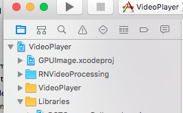

## react-native-video-processing

 [](https://travis-ci.org/shahen94/react-native-video-processing) [](https://github.com/semantic-release/semantic-release) [](https://badge.fury.io/js/react-native-video-processing) 

### Getting Started
```sh
npm install react-native-video-processing --save
```
### You can check test just running
`$ npm test` or `$ yarn test`

### Manual installation

**Note: For RN 0.4x use 1.0 version, For RN 0.3x use  0.16**
#### [Android]
```sh
$ react-native link react-native-video-processing
```
#### [iOS]

1. In Xcode, click the "Add Files to <your-project-name>".
2. Go to `node_modules` ➜ `react-native-video-processing/ios` and add `RNVideoProcessing` directory.
3. Make sure `RNVideoProcessing` is "under" the "top-level".
4. Add `GPUImage.xcodeproj` from `node_modules/react-native-video-processing/ios/GPUImage/framework` directory to your project and make sure it is "under" the "top-level":

    

5. In XCode, in the project navigator, select your project.

   Add
    - CoreMedia
    - CoreVideo
    - OpenGLES
    - AVFoundation
    - QuartzCore
    - GPUImage
    - MobileCoreServices

    to your project's `Build Phases` ➜ `Link Binary With Libraries`.
6. Import `RNVideoProcessing.h` into your `project_name-bridging-header.h`.
7. Clean and Run your project.

## Usage
```javascript
import React, { Component } from 'react';
import { View } from 'react-native';
import { VideoPlayer, Trimmer } from 'react-native-video-processing';

class App extends Component {
    trimVideo() {
        const options = {
            startTime: 0,
            endTime: 15,
            quality: VideoPlayer.Constants.quality.QUALITY_1280x720, // iOS only
            saveToCameraRoll: true, // default is false // iOS only
            saveWithCurrentDate: true, // default is false // iOS only
        };
        this.videoPlayerRef.trim(options)
            .then((newSource) => console.log(newSource))
            .catch(console.warn);
    }

    // iOS only
    compressVideo() {
        const options = {
            width: 720,
            endTime: 1280,
            bitrateMultiplier: 3,
            saveToCameraRoll: true, // default is false
            saveWithCurrentDate: true, // default is false
            minimumBitrate: 300000
        };
        this.videoPlayerRef.compress(options)
            .then((newSource) => console.log(newSource))
            .catch(console.warn);
    }

    getPreviewImageForSecond(second) {
        const maximumSize = { width: 640, height: 1024 }; // default is { width: 1080, height: 1080 } iOS only
        this.videoPlayerRef.getPreviewForSecond(second, maximumSize) // maximumSize is iOS only
        .then((base64String) => console.log('This is BASE64 of image', base64String))
        .catch(console.warn);
    }

    getVideoInfo() {
        this.videoPlayerRef.getVideoInfo()
        .then((info) => console.log(info))
        .catch(console.warn);
    }

    render() {
        return (
            <View style={{ flex: 1 }}>
                <VideoPlayer
                    ref={ref => this.videoPlayerRef = ref}
                    startTime={30}  // seconds
                    endTime={120}   // seconds
                    play={true}     // default false
                    replay={true}   // should player play video again if it's ended
                    rotate={true}   // use this prop to rotate video if it captured in landscape mode iOS only
                    source={'file:///sdcard/DCIM/....'}
                    playerWidth={300} // iOS only
                    playerHeight={500} // iOS only
                    style={{ backgroundColor: 'black' }}
                    onChange={({ nativeEvent }) => console.log({ nativeEvent })} // get Current time on every second
                />
                <Trimmer
                    source={'file:///sdcard/DCIM/....'}
                    height={100}
                    width={300}
                    onTrackerMove={(e) => console.log(e.currentTime)} // iOS only
                    currentTime={this.video.currentTime} // use this prop to set tracker position iOS only
                    themeColor={'white'} // iOS only
                    trackerColor={'green'} // iOS only
                    onChange={(e) => console.log(e.startTime, e.endTime)}
                />
            </View>
        );
    }
}
```

### How to setup Library
[](https://youtu.be/HRjgeT6NQJM)

##Contributing

1. Please follow the eslint style guide.
2. Please commit with `$ npm run commit`

## Roadmap
1.  [ ] Use FFMpeg instead of MP4Parser
2.  [ ] Add ability to add GLSL filters
3.  [ ] Android should be able to compress video
4.  [ ] More processing options
5.  [ ] Create native trimmer component for Android
